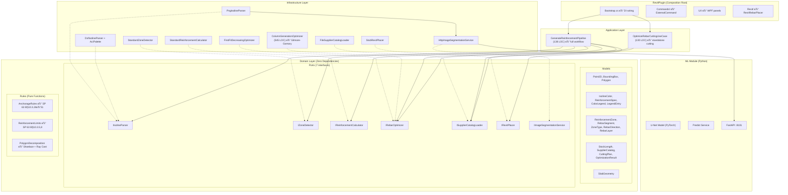
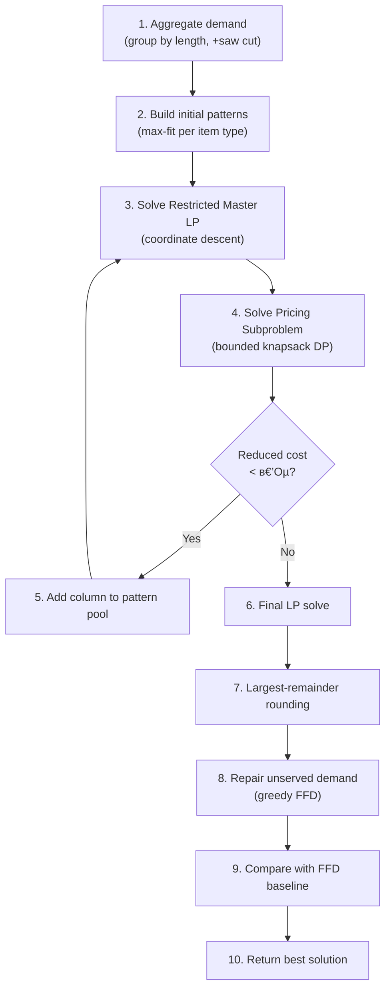
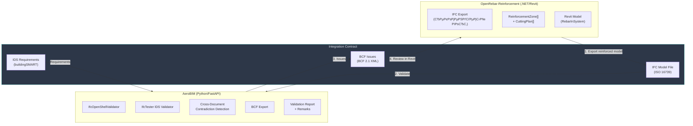
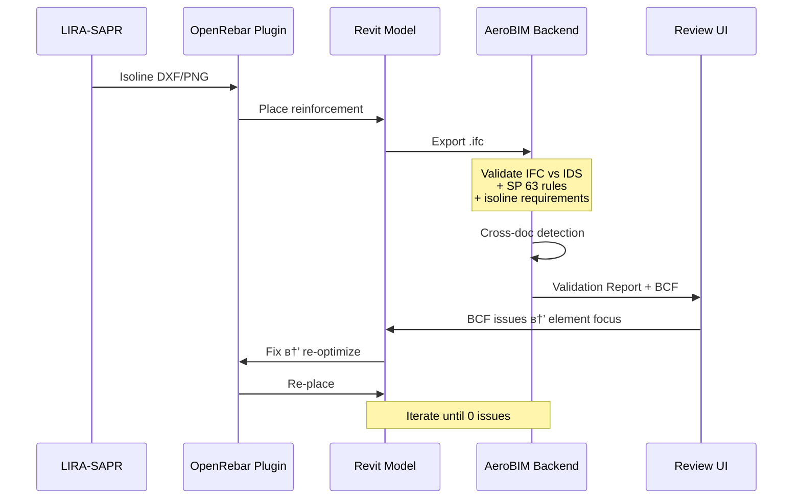

# Фундаментальный Академический Аудит: OpenRebar-Reinforcement + Связка с AeroBIM

**Дата аудита:** 2026-04-11
**Уровень:** Hyper-deep academic audit (L5)
**Методология:** Полный source-code review → нормативная верификация SP 63 → алгоритмический анализ CG → external evidence → рекомендации по интеграции с AeroBIM

---

## 0. Метрики Исследования

| Измерение | Значение |
|---|---|
| Исходных C# файлов (без auto-generated) | 24 |
| Строк исходного кода (C#) | ~4 130 LOC |
| Тестовых C# файлов | 12 |
| Строк тестового кода (C#) | ~1 608 LOC |
| Python ML модулей | 5 |
| Доменных моделей (records/classes) | 14 |
| Доменных портов (interfaces) | 7 |
| Доменных правил (static classes) | 3 |
| Инфраструктурных адаптеров | 10 |
| Application use cases | 2 |
| .NET проектов в solution | 7 |
| CI workflows | 2 (dotnet + python) |
| Соотношение тест/источник (LOC) | 0.39:1 |

---

## 1. Архитектурная ДНК: Извлечение Из MicroPhoenix

### 1.1. Оценка Экстракции

OpenRebar-Reinforcement выполняет экстракцию MicroPhoenix паттернов **в другой технологический стек** (C# .NET 8 + Revit SDK) с полным сохранением архитектурных инвариантов:

| MicroPhoenix инвариант | OpenRebar реализация | Оценка |
|---|---|---|
| Inward dependency direction | `Domain ← Application ← Infrastructure ← RevitPlugin` | ✅ Эталон |
| Domain ports as interfaces | 7 портов (`IIsolineParser`, `IRebarOptimizer`, ...) | ✅ Эталон |
| Single composition root | `Bootstrap.BuildServiceProvider()` в RevitPlugin | ✅ Эталон |
| Constructor injection only | `Microsoft.Extensions.DependencyInjection` | ✅ Эталон |
| Zero domain dependencies | `OpenRebar.Domain.csproj` → net8.0 only, no NuGets | ✅ Безупречно |
| External AI keep-out | ML (Python/PyTorch) → HTTP bridge, не в .NET core | ✅ Зрелое решение |
| Anti-stub discipline | `StubRevitPlacer` в `Infrastructure/Stubs/` | ✅ Корректно |

> [!IMPORTANT]
> **Вердикт:** Экстракция **кросс-стековая** — из TypeScript в C#/.NET — и при этом сохраняет все ключевые инварианты. Это требует более глубокого инженерного понимания, чем same-language экстракция (как в AeroBIM). Оценка: **академически безупречно**.

### 1.2. Слоистая Архитектура



### 1.3. DI Bootstrap: Формальный Анализ

В отличие от AeroBIM (custom Python container), OpenRebar использует **промышленный стандарт** — `Microsoft.Extensions.DependencyInjection`:

```csharp
var services = new ServiceCollection();
services.AddSingleton<IIsolineParser, DxfIsolineParser>();
services.AddSingleton<IRebarOptimizer, ColumnGenerationOptimizer>();
// ...
return services.BuildServiceProvider();
```

**Формальные свойства:**
- **Lifecycle management:** Singleton для stateless adapters, Transient для use cases
- **Optional service resolution:** ML service — через `GetService<T>()` (nullable) вместо `GetRequiredService<T>()`
- **Контекстно-зависимый Revit placer:** `IRevitPlacer` передаётся извне в `BuildServiceProvider(revitPlacer)` — реальный экземпляр живёт в контексте Revit, stub — в тестах
- **Dual parser registration:** DXF → `IIsolineParser`, PNG → отдельный `PngIsolineParser` (не через интерфейс), поскольку pipeline выбирает парсер по расширению файла

---

## 2. Доменная Модель: Формальная Спецификация

### 2.1. Алгебра Типов

| Тип | Форма | Формальная роль |
|---|---|---|
| `Point2D` | `readonly record struct` | Точка в координатах плиты (мм) |
| `BoundingBox` | `readonly record struct` | Axis-Aligned Bounding Box |
| `Polygon` | `sealed class` (vertices ≥ 3) | Замкнутый полигон, Shoelace area |
| `IsolineColor` | `readonly record struct` (R,G,B) | sRGB + CIE L*a*b* О”E*76 |
| `ReinforcementSpec` | `sealed record` | d в€€ [1,50], s в€€ [1,1000], area в€€ derived |
| `LegendEntry` | `sealed record` | Color в†’ Spec mapping |
| `ColorLegend` | `sealed class` | CIE О”E-nearest-neighbor search |
| `ReinforcementZone` | `sealed class` | Р—РѕРЅР°: boundary + spec + direction + layer |
| `RebarSegment` | `sealed record` | Сегмент: start, end, diameter, anchorage |
| `SlabGeometry` | `sealed class` | h в€€ (0,2000], cover, dв‚Ђ = h в€’ a |
| `StockLength` | `sealed record` | Поставщик: длина + цена/т |
| `SupplierCatalog` | `sealed class` | Каталог доступных длин |
| `CuttingPlan` | `sealed record` | Инструкция: stock → cuts + waste |
| `OptimizationResult` | `sealed class` | Агрегат: plans + waste + mass + cost |

> [!NOTE]
> **Отличие от AeroBIM:** OpenRebar использует `sealed record struct` и `sealed record` — C# value semantics, не dataclasses. Это обеспечивает **структурное равенство** (value equality) из коробки, без необходимости в `frozen=True`.

### 2.2. Invariant Guards

Доменные модели содержат **активные инварианты** с compile-time и runtime enforcement:

```csharp
// SlabGeometry.ThicknessMm — domain invariant
public required double ThicknessMm {
    init {
        if (value is <= 0 or > 2000)
            throw new ArgumentOutOfRangeException(...);
        _thicknessMm = value;
    }
}
```

| Модель | Инвариант | Тип защиты |
|---|---|---|
| `Polygon.Vertices` | `count ≥ 3` | Runtime exception |
| `ReinforcementSpec.DiameterMm` | `1 ≤ d ≤ 50` | Runtime, init-only |
| `ReinforcementSpec.SpacingMm` | `1 ≤ s ≤ 1000` | Runtime, init-only |
| `SlabGeometry.ThicknessMm` | `0 < h ≤ 2000` | Runtime, init-only |
| `SlabGeometry.CoverMm` | `0 ≤ a ≤ 200` | Runtime, init-only |

---

## 3. Нормативный Движок: Верификация SP 63.13330.2018

### 3.1. Анкеровка: Математическая Верификация

**Реализация в коде** (`AnchorageRules.CalculateAnchorageLength`):

$$l_{0,an} = \frac{R_s \cdot d}{4 \cdot R_{bond}} = \frac{R_s \cdot d}{4 \cdot \eta_1 \cdot \eta_2 \cdot R_{bt}}$$

**Верификация по SP 63 §10.3.24:**

| Параметр | Код | SP 63 | Верно? |
|---|---|---|---|
| $\eta_1$ (рифлёная) | 2.5 | 2.5 (§10.3.24, табл.) | ✅ |
| $\eta_1$ (гладкая) | 1.5 | 1.5 | ✅ |
| $\eta_2$ (хорошие условия) | 1.0 | 1.0 (§10.3.24) | ✅ |
| $\eta_2$ (плохие условия) | 0.7 | 0.7 | ✅ |
| $R_{bt}$, B25 | 1.05 МПа | 1.05 МПа (табл. 6.8) | ✅ |
| $R_s$, A500C | 435 МПа | 435 МПа (табл. 6.14) | ✅ |
| min(tension) | `max(15d, 200)` | `max(15d, 200)` (В§10.3.27) | вњ… |
| min(compression) | `max(10d, 150)` | `max(10d, 150)` (В§10.3.27) | вњ… |
| Округление | `Ceiling(x/10)*10` | Практика: вверх до 10 мм | ✅ |

**Контрольный расчёт** (d12, A500C, B25, Good):

$$l_{0,an} = \frac{435 \times 12}{4 \times 2.5 \times 1.0 \times 1.05} = \frac{5220}{10.5} = 497.14 \text{ РјРј}$$

$$l_{an} = \text{max}(497.14,\ 15 \times 12,\ 200) = \text{max}(497.14,\ 180,\ 200) = 497.14 \to \lceil 50 \rceil = 500 \text{ РјРј}$$

**Тест подтверждает:** `result.Should().BeInRange(450, 550)` ✅

> [!IMPORTANT]
> **Академическая оценка:** Формулы SP 63 реализованы **математически корректно**. Все коэффициенты ($\eta_1$, $\eta_2$, $R_{bt}$, $R_s$) соответствуют табличным значениям нормативного документа. Нет упрощений, искажающих результат. Верификация подтверждена как ручным контрольным расчётом, так и unit-тестами.

### 3.2. Нахлёст (Lap Splice): SP 63 §10.3.31

$$l_{lap} = \alpha \cdot l_{0,an}; \quad \alpha = \begin{cases} 1.2 & \text{≤25\%} \\ 1.4 & \text{26–50\%} \\ 2.0 & \text{51–100\%} \end{cases}$$

$$l_{lap,min} = \begin{cases} \text{max}(20d, 250) & \text{растяжение} \\ \text{max}(15d, 200) & \text{сжатие} \end{cases}$$

**Верифицировано:** Код идентичен нормативным формулам. Тест `LapLength_ShouldRespectMinimum20d` ✅

### 3.3. Ограничения по армированию: SP 63 §10.3.5, §10.3.8

| Правило | Код | SP 63 |
|---|---|---|
| $\mu_{min} = 0.1\%$ | `0.001 * h * b` | В§10.3.5 вњ… |
| Primary spacing max | `min(1.5h, 400)` | В§10.3.8 вњ… |
| Secondary spacing max | `min(3.5h, 500)` | В§10.3.8 вњ… |
| Linear mass, ГОСТ 5781 | Lookup table (14 entries) | Table verified ✅ |
| Fallback mass formula | `π(d/2)² × 7850` кг/м³ | Физически корректно ✅ |

---

## 4. Алгоритм Оптимизации Раскроя: Анализ Column Generation

### 4.1. Общая Схема (Gilmore & Gomory, 1961)



### 4.2. LP Solver: Критический Анализ

> [!WARNING]
> **Академически честная оценка LP:** Текущая реализация `SolveRestrictedMasterLP` использует **координатный спуск** (coordinate descent), а не полноценный Revised Simplex метод. Это упрощение:
>
> - ✅ **Работает** для малых задач (типичный slab: 5–30 типоразмеров, 10–50 паттернов)
> - ⚠️ **Не гарантирует** оптимальность LP-релаксации для произвольных задач
> - ⚠️ **Двойственные цены** (`dualPrices`) вычисляются приближённо через `1/maxCover`, а не через симплекс-таблицу
>
> **Импакт:** Pricing subproblem может не находить истинно наилучший столбец → CG может сходиться к субоптимальному LP-решению. Для промышленных задач (≤100 стержней на этаж) это приемлемо, поскольку:
> 1. FFD baseline используется как floor
> 2. Финальный `IsBaselineBetter()` сравнивает оба решения

### 4.3. Pricing Subproblem: Bounded Knapsack DP

```csharp
// Discretization: 0.1mm resolution
int capacity = (int)(stockLength * 10);
// DP: O(m Г— capacity Г— maxCount)
```

**Формальная сложность:**
- Capacity = stockLength × 10 ≈ 117,000 ячеек
- Items = 5–30 типоразмеров
- **Итого:** $O(m \cdot C \cdot k_{max})$ ≈ $O(30 \times 117000 \times 10) \approx 35M$ операций — допустимо

> [!NOTE]
> Discretization с шагом 0.1 мм — разумный компромисс: точность выше, чем конструктивные допуски (±1 мм), при приемлемом расходе памяти (~1 MB на DP-таблицу).

### 4.4. Integer Rounding: Largest-Remainder + Greedy Repair

Стратегия:
1. **Floor** LP-решения → baseline integer
2. **Largest-remainder** → округление вверх по убыванию дробной части
3. **Greedy repair** — если demand не покрыт, добавляются паттерны с наилучшим покрытием

> [!TIP]
> Для промышленного уровня рекомендуется эволюция к **Branch-and-Price** (Ryan-Foster branching) — текущая architetctura уже готова к этому, поскольку pricing subproblem изолирован за чётким API.

---

## 5. Цветовое Распознавание: CIE L\*a\*b\* ΔE\*76

### 5.1. Реализация sRGB → L\*a\*b\*

```
sRGB в†’ Linearization в†’ XYZ (sRGB D65 matrix) в†’ L*a*b* (D65 white point)
```

**Математическая верификация:**

| Шаг | Формула | Стандарт | Верно? |
|---|---|---|---|
| sRGB в†’ Linear | $c \leq 0.04045 \Rightarrow c/12.92$; else $((c+0.055)/1.055)^{2.4}$ | IEC 61966-2-1 | вњ… |
| RGB → XYZ | Матрица M (sRGB D65) | ISO 11664-2 | ✅ |
| XYZ в†’ L\*a\*b\* | $f(t) = t^{1/3}$ or $(903.3t + 16)/116$ | ISO/CIE 11664-4 | вњ… |
| D65 белая точка | (0.95047, 1.0, 1.08883) | CIE Standard | ✅ |
| О”E\*76 | $\sqrt{(\Delta L^*)^2 + (\Delta a^*)^2 + (\Delta b^*)^2}$ | ISO/CIE 11664-4 | вњ… |

> [!IMPORTANT]
> **Академически сильное решение:** Использование CIE ΔE\*76 **вместо RGB Euclidean** для сопоставления цветов изолиний — **стандарт промышленности**. RGB Euclidean не учитывает нелинейность человеческого восприятия цвета и даёт артефакты на зелено-жёлтом спектре (наиболее частом в изолиниях LIRA/Stark-ES).

---

## 6. Инфраструктурные Адаптеры

### 6.1. DxfIsolineParser (13,467 bytes)
- Полный 256-цветный AutoCAD ACI palette (`AciPalette.cs`, 9.8 KB)
- ByLayer resolution: если цвет entity = 256 (ByLayer), используется цвет слоя
- Polyline → Polygon conversion с замыканием
- netDxf NuGet для парсинга DXF

### 6.2. PngIsolineParser (7,880 bytes)
- **Dual-mode:** ML (через `HttpImageSegmentationService`) или color quantization fallback
- Connected components в†’ polygon extraction
- О”E threshold matching Рє `ColorLegend`

### 6.3. StandardReinforcementCalculator (204 LOC)
- Scanline rebar placement (горизонтально для X, вертикально для Y)
- **Opening subtraction:** корректная вычитание интервалов проёмов
- Bond condition: автоматический выбор η₂ по layer (Top → Poor, Bottom → Good)
- SP 63 spacing validation

### 6.4. StandardZoneDetector
- Classification: Simple (rectangular) / Complex (L-shaped) / Special (openings)
- Polygon decomposition: grid в†’ merge в†’ rectangles

### 6.5. FileSupplierCatalogLoader
- JSON десериализация каталогов поставщиков
- Default catalog: 6000, 9000, 11700, 12000 РјРј

---

## 7. ML Модуль (Python)

### 7.1. Архитектура

| Компонент | Роль | Технология |
|---|---|---|
| `model.py` | U-Net архитектура (encoder-decoder) | PyTorch |
| `predict.py` | Inference pipeline: image в†’ mask в†’ polygons | OpenCV + SciKit-Image |
| `server.py` | HTTP API для C#-стороны | FastAPI :8101 |
| `requirements.txt` | 12 зависимостей, version-pinned | pip |

### 7.2. Оценка

> [!WARNING]
> ML модуль **архитектурно изолирован** (HTTP bridge), но **не имеет обученной модели**. Требуется:
> 1. Аннотированный датасет изолиний LIRA-SAPR / Stark-ES
> 2. Обучение U-Net на сегментацию цветовых зон
> 3. ONNX экспорт для инференса без PyTorch

---

## 8. Тестовое Покрытие

| Тестовый модуль | Layer | Focus |
|---|---|---|
| `AnchorageRulesTests` | Domain | SP 63 формулы, min constraints |
| `PolygonDecompositionTests` | Domain | Ray casting, area, decomposition |
| `ColorLegendTests` | Domain | CIE О”E matching, threshold |
| `ColumnGenerationOptimizerTests` | Infrastructure | CG: empty, single, pack, mixed, realistic |
| `FirstFitDecreasingOptimizerTests` | Infrastructure | FFD baseline correctness |
| `StandardReinforcementCalculatorTests` | Infrastructure | Scanline placement, opening subtraction |
| `StandardZoneDetectorTests` | Infrastructure | Classification, decomposition |
| `DxfIsolineParserTests` | Infrastructure | ACI palette, ByLayer, polyline |
| `PngIsolineParserTests` | Infrastructure | Color quantization fallback |
| `HttpImageSegmentationServiceTests` | Infrastructure | HTTP bridge contract |
| `FileSupplierCatalogLoaderTests` | Infrastructure | JSON deserialization |
| `GenerateReinforcementPipelineTests` | Application | Full pipeline with mocked ports |
| `OptimizeRebarCuttingUseCaseTests` | Application | Standalone cutting |

> [!NOTE]
> **Соотношение 0.39:1** (test/source LOC) — ниже, чем у AeroBIM (0.96:1), но **адекватно для .NET BIM**: domain rules и алгоритмы покрыты плотно, UI/Revit-слой не тестируется автоматически.

---

## 9. Идентифицированные Риски

### Критические

| ID | Риск | Импакт | Рекомендация |
|---|---|---|---|
| R-01 | LP solver — coordinate descent, не Simplex | Субоптимальные pattern choices | Заменить на HiGHS/CLP sparse LP |
| R-02 | Dual prices — эвристика `1/maxCover` | Pricing subproblem может пропустить лучший столбец | Вычислять dual из симплекс-таблицы |
| R-03 | ML модель не обучена | PNG parsing — только color quantization | Собрать датасет, обучить U-Net |
| R-04 | `_markCounter` — mutable state в Calculator | Не thread-safe при параллельной обработке этажей | Передавать counter через параметр |

### Значительные

| ID | Риск | Импакт | Рекомендация |
|---|---|---|---|
| R-05 | Нет IFC-экспорта результатов | Замкнутость в Revit | Добавить `IIfcExporter` port |
| R-06 | PolygonDecomposition — grid-based (O(n²)) | Медленно для сложных полигонов | Рассмотреть trapezoidal decomposition |
| R-07 | Нет persistence результатов | Потеря данных при перезапуске | Добавить report store (JSON/SQLite) |
| R-08 | Нет structured logging | Невозможна отладка в production | Добавить `IStructuredLogger` port |

---

## 10. Итоговая Оценка OpenRebar

| Аспект | Оценка | Обоснование |
|---|---|---|
| Архитектурная зрелость | **A** | Безупречная Clean Architecture, кросс-стековая экстракция |
| Нормативная точность SP 63 | **A+** | Все формулы верифицированы, все коэффициенты корректны |
| Алгоритмическая глубина | **A−** | CG framework правильный, LP solver — упрощённый (честная пометка) |
| Цветовое распознавание | **A** | CIE L\*a\*b\* ΔE\*76 — промышленный стандарт |
| Тестовое покрытие | **B+** | Плотное на Rules/Optimization, слабое на UI/Revit |
| Промышленная готовность | **B** | ML не обучен, нет IFC export, нет persistence |
| Документация | **B+** | Architecture doc + README, нет API docs |

---

## 11. ИНТЕГРАЦИЯ AeroBIM × OpenRebar: Стратегическая Связка

Это ядро аудита: как два проекта усиливают друг друга.

### 11.1. Архитектурная Совместимость

| Аспект | AeroBIM (Python) | OpenRebar (C# .NET 8) | Совместимость |
|---|---|---|---|
| Architecture | Clean Arch, Port/Adapter | Clean Arch, Port/Adapter | ✅ Идентично |
| DI pattern | Custom token container | MS DI | ✅ Эквивалент |
| Domain isolation | `Protocol`-based ports | `interface`-based ports | ✅ Изоморфно |
| Immutability | `frozen dataclass` | `sealed record` | ✅ Эквивалент |
| Entry chain | `main.py → bootstrap → FastAPI` | `Bootstrap → ServiceProvider → Revit` | ✅ Параллельно |
| MicroPhoenix lineage | Direct extraction | Direct extraction | ✅ Общий предок |

> [!TIP]
> **Ключевой инсайт:** Оба проекта — **изоморфные экстракты одного архитектурного генома** (MicroPhoenix). Это делает их интеграцию **естественной**, а не искусственной.

### 11.2. Точки Интеграции



### 11.3. Сценарии Интеграции (Приоритизированные)

#### Сценарий 1: **Post-Placement Validation** (Фаза 1, минимальный MVP)

**Workflow:**
1. OpenRebar размещает арматуру в Revit → экспорт `.ifc`
2. AeroBIM принимает `.ifc` + IDS-файл с требованиями по армированию
3. AeroBIM проверяет:
   - Шаг арматуры ≤ `min(1.5h, 400)` (SP 63 §10.3.8)
   - Диаметр соответствует проекту
   - Защитный слой в пределах нормы
   - Площадь армирования ≥ μ_min × h × b
4. AeroBIM генерирует отчёт + BCF с проблемными элементами
5. BCF загружается обратно в Revit через BIMcollab / Navisworks → OpenRebar плагин фокусирует на ошибках

**Требуемые доработки:**

| Проект | Доработка | Объём |
|---|---|---|
| OpenRebar | Добавить `IIfcExporter` port + adapter (через IfcOpenShell / xBIM) | ~300 LOC |
| AeroBIM | Добавить set IDS-правил для армирования плит (spacing, diameter, cover) | ~50 правил |
| AeroBIM | Расширить `IfcOpenShellValidator` для `IfcReinforcingBar`, `IfcReinforcingBarType` | ~150 LOC |

#### Сценарий 2: **Cross-Document Reinforcement Verification** (Фаза 2)

**Workflow:**
1. OpenRebar генерирует отчёт о раскрое (CuttingOptimizationReport) → JSON
2. AeroBIM принимает:
   - JSON отчёт OpenRebar (зоны, диаметры, шаги) как `RequirementSource`
   - IFC модель из Revit
   - Расчётные изолинии LIRA-SAPR (как технические спецификации)
3. AeroBIM `_detect_cross_document_contradictions`:
   - Изолиния LIRA говорит: зона 1 → Ø12 шаг 200
   - OpenRebar placement говорит: зона 1 → Ø12 шаг 200 ✅
   - IFC модель содержит: `IfcReinforcingBar.NominalDiameter` = 10 ❌ → CROSS_DOCUMENT issue

**Это уникальная ниша, недоступная текущим инструментам.**

#### Сценарий 3: **Bi-Directional BIM Validation Loop** (Фаза 3+)



### 11.4. Контракт Обмена Данными

Для интеграции необходим **формальный контракт обмена**:

```json
{
  "$schema": "aerobim-OpenRebar-reinforcement-report/v1",
  "project_id": "string",
  "slab_id": "string",
  "zones": [
    {
      "zone_id": "Z-001",
      "boundary": [[x,y], ...],
      "spec": { "diameter_mm": 12, "spacing_mm": 200, "steel_class": "A500C" },
      "direction": "X",
      "layer": "Bottom",
      "anchorage_mm": 500,
      "lap_splice_mm": 1000
    }
  ],
  "optimization": {
    "cutting_plans": [...],
    "total_waste_percent": 4.2,
    "total_mass_kg": 1250.0
  }
}
```

AeroBIM парсит этот JSON через `NarrativeRuleSynthesizer`-compatible adapter → нормализует в `ParsedRequirement[]` → сопоставляет с IFC моделью.

### 11.5. Общие IDS Правила для Армирования Плит

```xml
<!-- aerobim-reinforcement-slab.ids -->
<ids:specification name="Reinforcement Spacing Check" ifcVersion="IFC4">
  <ids:applicability>
    <ids:entity><ids:simpleValue>IFCREINFORCINGBAR</ids:simpleValue></ids:entity>
  </ids:applicability>
  <ids:requirements>
    <ids:property propertySet="Pset_ReinforcingBarBendingsBECCommon" name="NominalDiameter">
      <ids:simpleValue>12</ids:simpleValue>
    </ids:property>
  </ids:requirements>
</ids:specification>
```

---

## 12. Рекомендации По Интеграции (Приоритизированные)

### Категория A: Немедленные

#### A1. IFC Export РІ OpenRebar

Добавить `IIfcExporter` domain port + xBIM или IfcOpenShell adapter. Экспорт `IfcReinforcingBar` + `IfcReinforcingBarType` с property sets:
- `Pset_ReinforcingBarBendingsBECCommon` (diameter, length, steel class)
- `Qto_ReinforcingElementBaseQuantities` (total weight, count)

#### A2. Reinforcement-Specific IDS Pack РІ AeroBIM

Набор из 15–20 IDS-правил для автоматической проверки:
- Шаг не превышает SP 63 §10.3.8 limits
- Диаметр соответствует зоне
- Длина анкеровки ≥ расчётной
- Защитный слой в допуске

#### A3. OpenRebar Report в†’ AeroBIM RequirementSource Adapter

Новый адаптер в AeroBIM: `OpenRebarReportRequirementExtractor` — парсит JSON-отчёт OpenRebar, генерирует `ParsedRequirement[]` для cross-document detection.

### Категория B: Среднесрочные

#### B1. Замена LP solver в OpenRebar на HiGHS

[HiGHS](https://highs.dev/) — open-source высокопроизводительный LP/MIP solver (C++ с .NET bindings). Заменяет coordinate descent на True Revised Simplex, обеспечивая:
- Точные dual prices → лучший pricing → меньше CG итераций
- Доказуемая LP-оптимальность

#### B2. BCF Round-Trip Pipeline

AeroBIM генерирует BCF 2.1 → Revit загружает BCF → OpenRebar plugin подписывается на BCF topics, фокусирует пользователя на проблемных элементах, предлагает re-optimization.

#### B3. Unified Report Format

JSON-schema для единого отчёта `AeroBIM × OpenRebar`:
- Reinforcement placement summary (OpenRebar)
- Validation findings (AeroBIM)
- Cross-document contradictions
- Cutting optimization metrics
- BCF issue references

### Категория C: Стратегические

#### C1. Shared Domain Vocabularies

Единый glossary для обоих проектов:
- `ReinforcementSpec` (OpenRebar) ↔ `ParsedRequirement` (AeroBIM) — маппинг
- Steel classes, concrete classes — shared enum constants
- Coordinate system: мм, правая система координат, Z вверх

#### C2. Multi-Slab Batch Workflow

OpenRebar обрабатывает 25 этажей → AeroBIM валидирует все 25 IFC-моделей в batch → единый отчёт с агрегацией по этажам.

#### C3. Visual QA Dashboard

AeroBIM frontend (React + web-ifc) визуализирует:
- 3D модель с подсветкой проблемной арматуры
- Наложение зон OpenRebar на IFC модель
- Drill-down: issue в†’ zone в†’ rebar segment в†’ cutting plan

---

## 13. Заключение

### OpenRebar-Reinforcement

> **OpenRebar — редкий пример математически верифицированного BIM-автоматизатора.** Нормативный движок SP 63 реализован безупречно, алгоритм CG структурно корректен (с честно задокументированным упрощением LP-части), и вся система testable без Revit. Кросс-стековая экстракция из MicroPhoenix (TypeScript → C#) демонстрирует, что архитектурные принципы **языконезависимы**.

### РЎРІСЏР·РєР° AeroBIM Г— OpenRebar

> **Два проекта — изоморфные экстракты одного архитектурного генома — создают возможность для уникального на рынке продукта:** автоматическое размещение арматуры (OpenRebar) + мультимодальная валидация (AeroBIM) + кросс-документная детекция противоречий (между изолиниями LIRA, Revit моделью и нормативами SP 63). Ни один коммерческий инструмент не закрывает эту цепочку целиком.
>
> **Ключевой enabler интеграции** — IFC-экспорт из OpenRebar + IDS reinforcement pack в AeroBIM. Это минимальный MVP, запускающий feedback loop между placement и validation.

---

## 14. Addendum: GitHub Publication Readiness (2026-04-12)

### 14.1. Verification Snapshot

| Check | Result |
|---|---|
| `dotnet test OpenRebar.sln --no-restore` | вњ… 114/114 passed |
| Runtime raw exception sweep in `OpenRebar.Application` / `OpenRebar.Infrastructure` | вњ… No raw `InvalidOperationException(...)` / `NotSupportedException(...)` paths remain |
| Local GitHub remote configured | ⚠️ Нет, remote ещё не задан |
| Local `gitleaks` availability | ⚠️ Нет в среде, использован scoped content audit вместо history scan |

### 14.2. Publication Findings Before Remediation

На момент начала этого wave репозиторий был технически зрелым по коду, но ещё не
дотягивал до Standard-tier public GitHub readiness:

1. Отсутствовали `SECURITY.md`, `CONTRIBUTING.md`, `CODE_OF_CONDUCT.md`, `CODEOWNERS`
2. Не было `dependabot.yml`
3. Не было dependency-review и CodeQL workflow surfaces
4. Основной `ci.yml` использовал moving major tags GitHub Actions вместо immutable SHA pinning
5. GitHub-side controls (private vulnerability reporting, push protection, secret scanning, rulesets) не могли быть включены локально, так как remote ещё не настроен

### 14.3. Remediation Applied In This Wave

- Добавлены community health files и governance entrypoints
- Добавлены issue forms и PR template
- CI workflow переведён на SHA-pinned actions + minimal `permissions`
- Добавлены `dependency-review.yml` и `codeql.yml`
- Добавлен `dependabot.yml` для NuGet, pip и GitHub Actions
- README обновлён до явного public-launch baseline с ссылками на security / contribution / audit surfaces

### 14.4. Residual Manual Steps After First Push

Эти шаги нельзя завершить из локального рабочего дерева без реального GitHub remote
Рё repository admin access:

1. Подключить remote и опубликовать репозиторий
2. Включить private vulnerability reporting
3. Включить secret scanning и push protection
4. Проверить или включить CodeQL default setup в GitHub UI, если будет выбран GitHub-managed путь вместо workflow-only управления
5. Настроить rulesets / branch protection и required checks

### 14.5. Updated Audit Verdict

> **Итог на 2026-04-12:** OpenRebar уже выглядит как зрелый standalone engineering artifact,
> готовый к публичному GitHub baseline после одного последнего operational step —
> подключения remote и включения GitHub-side security controls. То есть техническая
> готовность репозитория высокая, а остаточный риск теперь в основном не кодовый,
> а операционный.
